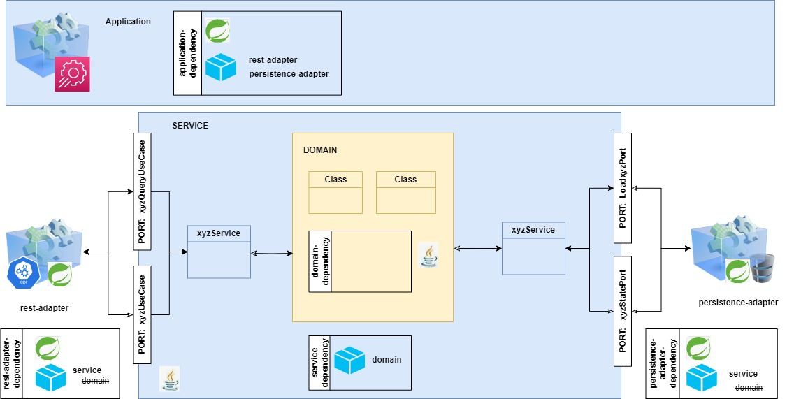

# About

Hexagonal architecture implementation following clea architecture principles

- The project is a typical ecommerce order-product application
- Application architecture can be seen below:

- <bold>Modules</bold>:
  - <bold>rest-adapter</bold>: 
    - Spring based REST controllers that expose API to perform e-commerce related operations
  - <bold>persistence-adapter<bold>:
    - Spring based JPA entities that govern persistence model and repositories to interact with database
  - <bold>service</bold>:
    - Mediator between adapters and domain exposing ports to various adapters and internally interacting with domain layer
  - <bold>domain</bold>:
    - Vanilla Java that contains core entity business logic
  - <bold>application</bold>:
    - Glue that configures all the service dependencies together
- <bold>Design Decisions</bold>:
  - One-Way model mapping strategy has been followed where:
    - <bold>Adapters</bold> have their own model
    - <bold>Ports</bold> and <bold>Domain</bold> share the same model:
      - Adapting two-way approach leads to convoluted objects
      - Further, increases maintenance of the application
      - In a large scale system, can become complex very quickly to manage state of various objects

# Usage (In progress)

- API: http://localhost:<APP-PORT>/swagger-ui/index.html
